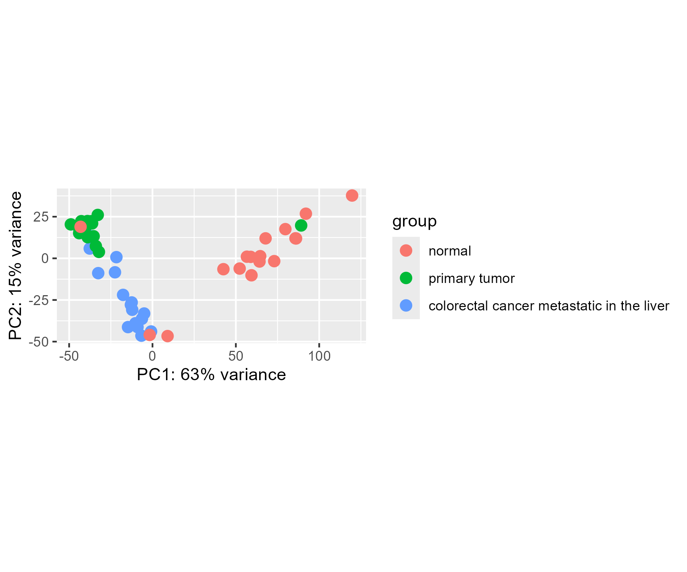
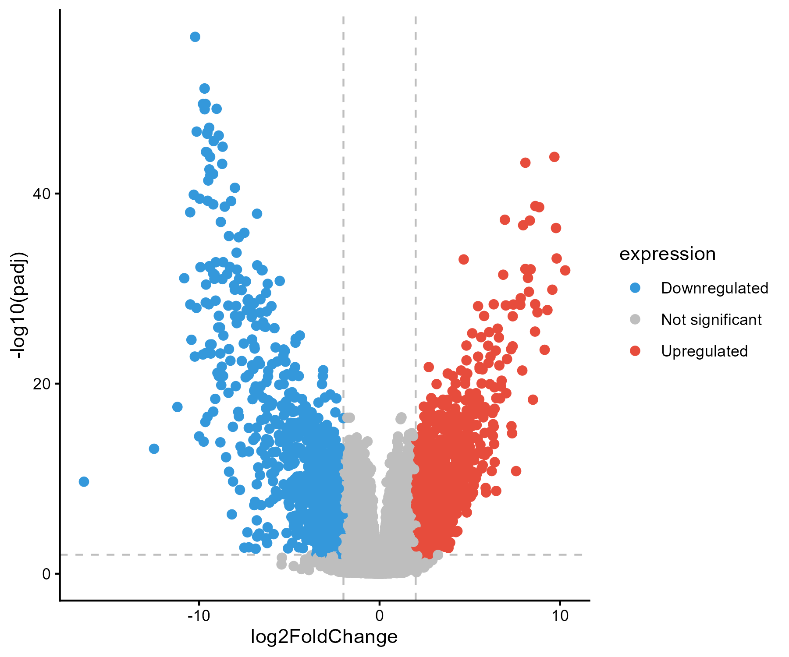
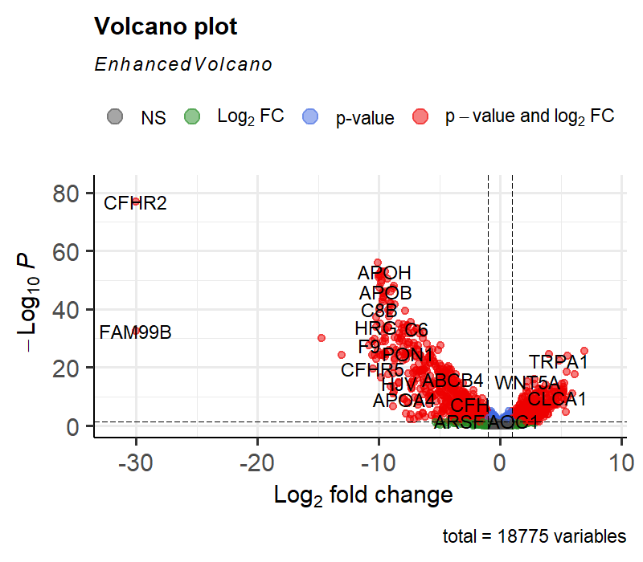
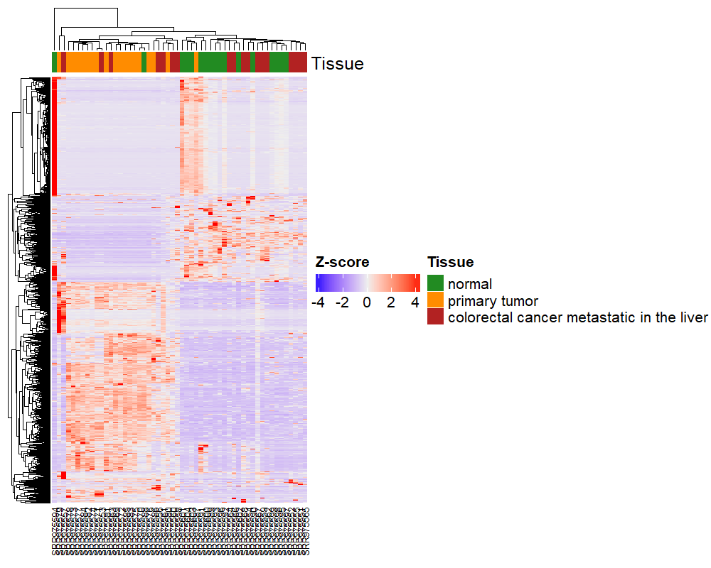

### DESeq2 Differential Expression Workflow

**Purpose**  
This repository contains a reproducible pipeline for conducting differential gene expression (DGE) analysis using raw counts, based on Griffith Lab tutorial: [Griffith Lab](https://genviz.org/module-04-expression/0004/02/01/DifferentialExpression/).

**Overview**  
- **Input:** raw counts matrix + sample metadata  
- **Steps:** create DESeqDataSet → run DESeq → extract results → visualize  
- **Outputs:** results tables, MA-plots, heatmaps, and other figures  

**Plots**  
  
  
  

